# Pump Wallet Tool 项目流程

## 项目定位

本项目把“观察目标钱包如何交易 Pump meme 币”整理成一条可复用的数据流水线：

1. 采集目标钱包交易。
2. 识别 Pump.fun / PumpSwap 买入、卖出和发币行为。
3. 汇总该钱包交易过的 meme token。
4. 拉取这些 token 在目标钱包交易窗口附近的市场交易。
5. 生成开仓和清仓条件画像。

## 目录职责

```text
pump_tool.py                         统一 CLI 入口
webui.py                             Gradio Web UI 入口（浏览器操作）
pyproject.toml                       项目元数据和 ruff 配置
pump_monitor/                        数据采集、分类、落盘
  _base_client.py                    限频与重试基类
  _utils.py                          共享工具函数
  rpc.py                             Solana JSON-RPC 客户端
  solscan.py                         Solscan Pro 客户端
  classifier.py                      Pump 交易分类逻辑
  meme_tokens.py                     钱包交易过的 meme token 汇总
  market_trades.py                   Helius 市场交易窗口抓取与标准化
  storage.py                         JSONL/CSV 存储层
  monitor.py                         原始底层 CLI 和流程编排
pump_analyst/                        行为画像和报告生成
  analyze.py                         可导入、可 `python -m` 的分析入口
  cli.py                             分析子命令 CLI 入口
  _conditions.py                     核心特征计算
  _reports.py                        报告生成
data/                                默认数据输出目录
pump_analyst/results/                默认分析报告输出目录
```

## 数据流

```mermaid
flowchart LR
    A["目标钱包地址"] --> B["scan: 拉取交易"]
    B --> C["classifier: 分类 Pump 交易"]
    C --> D["data/<wallet>.jsonl / .csv"]
    D --> E["tokens: 汇总 meme token"]
    E --> F["data/<wallet>.meme_tokens.csv"]
    F --> G["market: 拉取市场交易窗口"]
    G --> H["data/<wallet>.market_trades/"]
    H --> I["analyze: 计算开仓/清仓特征"]
    I --> J["pump_analyst/results/<wallet>/"]
```



## 推荐使用方式

### 方式一：Web UI（推荐新手）

在浏览器中操作所有功能，无需记忆命令行参数：

```bash
source .venv/bin/activate
python webui.py
# 浏览器打开 http://0.0.0.0:7860
```

界面包含 6 个标签页：

| 标签 | 功能 |
|------|------|
| 🚀 Pipeline | 一键运行完整流程（扫描→去重→代币汇总→市场交易→分析报告） |
| 🔍 Scan | 抓取钱包交易并分类 Pump 活动 |
| 📊 Market | 拉取每个 mint 的市场交易窗口 |
| 🔎 Inspect | 诊断单笔交易的 Pump 分类详情 |
| 📈 Analyze | 生成开仓/清仓行为画像报告 |
| 📁 Results | 浏览 CSV 表格、Markdown 报告、原始 JSONL 数据 |

### 方式二：命令行

先配置环境：

```bash
python3 -m venv .venv
source .venv/bin/activate
pip install -r requirements.txt
```

完整运行：

```bash
export HELIUS_API_KEY="你的Helius API key"
python pump_tool.py \
  --wallet <WALLET> \
  --rpc-url "https://mainnet.helius-rpc.com/?api-key=你的API_KEY" \
  pipeline \
  --limit 100 \
  --rpc-min-interval 0.5 \
  --refresh-seen
```

只使用本地已有数据重跑报告：

```bash
python pump_tool.py --wallet <WALLET> analyze
```

本地已有钱包数据，但还没抓市场交易：

```bash
python pump_tool.py --wallet <WALLET> tokens
python pump_tool.py --wallet <WALLET> --helius-api-key "$HELIUS_API_KEY" market
python pump_tool.py --wallet <WALLET> analyze
```

诊断单笔交易分类：

```bash
python pump_tool.py \
  --wallet <WALLET> \
  --rpc-url "你的RPC地址" \
  inspect <SIGNATURE>
```

可选安装成本地命令：

```bash
pip install -e .
pump-tool --help
```

## 输出解释

`data/<wallet>.csv` 是钱包交易摘要，适合人工快速筛选。

`data/<wallet>.jsonl` 保留完整结构化记录，适合后续重新计算或补字段。

`data/<wallet>.meme_tokens.csv` 是以 mint 为单位的钱包持仓/买卖汇总。

`data/<wallet>.market_trades/` 保存每个 mint 的市场窗口原始交易和标准化 CSV。

`pump_analyst/results/<wallet>/entry_features.csv` 保存每个 mint 开仓前特征。

`pump_analyst/results/<wallet>/exit_features.csv` 保存每个发生过卖出的 mint 清仓前特征。

`pump_analyst/results/<wallet>/report.md` 和 `exit_report.md` 是中文画像报告。

## 判断口径

钱包交易分类由 `pump_monitor/classifier.py` 完成。当前优先识别 Pump.fun 和 PumpSwap program id，再结合钱包 SOL 变化与 token 变化推断 `pump_buy` 或 `pump_sell`。

市场交易由 Helius Enhanced Transactions 按 mint 地址抓取，再过滤出确实包含该 mint 的交易。分析时只使用能从 fee payer 的 SOL/token 余额变化推断方向，且 SOL 变化达到阈值的有效交易，默认阈值是 `0.005 SOL`。

## 常见扩展点

新增数据源：扩展 `pump_monitor/rpc.py` 或 `pump_monitor/solscan.py`，并在 `monitor.build_client()` 注册。

新增交易分类规则：修改 `pump_monitor/classifier.py`，必要时用 `--inspect-signature` 对单笔交易诊断。

新增指标或报告：在 `pump_analyst/_conditions.py` 里增加特征字段，在 `pump_analyst/_reports.py` 里补充报告段落和汇总规则。

新增一键流程：优先修改 `pump_tool.py`，保持底层模块可单独运行。
